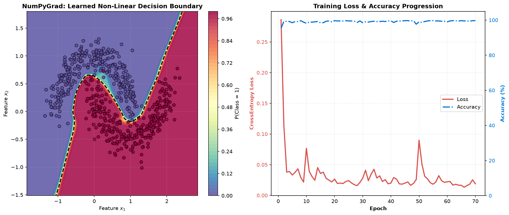

# NumPyGrad: Pure NumPy Autograd & Deep Learning Engine

[](https://github.com/Htet-Aung/numpygrad)
[](LICENSE)
[](https://www.python.org/downloads/)
[](#)
[](#)

A transparent, educational deep learning library and dynamic tensor automatic differentiation engine built from scratch using **pure Python and NumPy**—with **zero external deep learning framework dependencies** (no PyTorch, JAX, TensorFlow, or Keras).

---

## Purpose & Philosophy

NumPyGrad was created as a bottom-up exploration into the mathematical and architectural foundations of modern deep learning frameworks. By building an autograd engine and neural network abstractions with only Python and standard NumPy arrays, every matrix operation, gradient accumulation hook, and graph traversal step remains completely visible and debuggable.

### Non-Goals
To maintain simplicity and educational clarity, NumPyGrad deliberately avoids:
- **GPU / CUDA acceleration:** Execution is strictly CPU-bound to prioritize clean, readable NumPy code over hardware-specific CUDA kernels.
- **Distributed training:** Designed for single-machine execution, rapid experimentation, and conceptual clarity.
- **Production framework replacement:** NumPyGrad is a learning artifact and portfolio project, not a competitor to industrial engines like PyTorch or JAX.

---

## Visual Showcase: Non-Linear Decision Boundary

NumPyGrad trains multi-layer perceptrons to resolve complex non-linear classification manifolds (e.g. Two Moons, Concentric Circles, Spirals) via topological reverse-mode backpropagation and AdamW optimization:

<p align="center">
  
</p>

---

## Key Features

- **Dynamic Computational DAG:** Reverse-mode automatic differentiation over dynamically constructed Directed Acyclic Graphs with depth-first topological traversal.
- **PyTorch-Style Modular Architecture:** `Module`, `Parameter`, `Linear`, `Conv2D`, `MaxPool2D`, `BatchNorm1d`, `Dropout`, `Flatten`, `Sequential`, and non-linear activations (`ReLU`, `Tanh`, `Sigmoid`, `GELU`).
- **Vectorized Spatial Convolutions:** 2D convolution and max pooling utilizing `im2col` matrix unfolding and analytical `col2im` gradient projection in pure NumPy.
- **Dataset & DataLoader Pipeline:** Clean data loading with multi-tensor datasets, mini-batch slicing, deterministic shuffling, and remainder batch policies.
- **Execution Modes & Autograd Guards:** Recursive `model.train()` and `model.eval()` mode propagation, plus `no_grad()` context managers and decorators.
- **Model Inspection & Diagnostics:** `model.summary(input_shape)` generating ASCII reports with layer output shapes, parameter counts, and memory footprint estimations.
- **Single-File Model Persistence:** Native `.ng` container serialization (`save_model` / `load_model` / `model.save()`) packaging architecture topology and compressed weights.
- **Interactive Streamlit Studio:** Multi-tab visualizer with real-time 2D decision boundary training, live coordinate inference with boundary marker overlay, expandable computation trace drawer, side-by-side **Model Capacity Comparison (A vs B)** laboratory, and interactive MNIST handwritten digit drawing canvas.
- **Mathematical Rigor:** 100% test coverage with centered finite-difference numerical gradient checks (`gradcheck` relative error $< 10^{-10}$).

---

## Installation

Install NumPyGrad in editable development mode with pip:

```bash
git clone https://github.com/Htet-Aung/numpygrad.git
cd numpygrad
pip install -e .
```

To include optional dependencies for the interactive Streamlit studio:
```bash
pip install -e ".[app]"
```

---

## Quickstart

Build, inspect, train, evaluate, and persist a deep neural network in under 40 lines of pure Python:

```python
import numpy as np
import numpygrad as ng
import numpygrad.nn as nn
import numpygrad.optim as optim
from numpygrad.core.tensor import Tensor, no_grad
from numpygrad.data import TensorDataset, DataLoader

# 1. Define Model Architecture
model = nn.Sequential(
    nn.Flatten(),
    nn.Linear(in_features=28 * 28, out_features=128),
    nn.BatchNorm1d(num_features=128),
    nn.ReLU(),
    nn.Dropout(p=0.2),
    nn.Linear(in_features=128, out_features=10)
)

# 2. Inspect Model Topology & Memory Footprint
model.summary(input_shape=(1, 28, 28))

# 3. Setup Loss Criterion, Optimizer, and DataLoader
criterion = nn.CrossEntropyLoss()
optimizer = optim.AdamW(model.parameters(), lr=1e-3, weight_decay=1e-4)

X_data = np.random.randn(256, 28, 28).astype(np.float32)
y_data = np.random.randint(0, 10, size=(256,))

dataset = TensorDataset(X_data, y_data)
loader = DataLoader(dataset, batch_size=32, shuffle=True)

# 4. Training Loop
model.train()
for epoch in range(3):
    for batch_x, batch_y in loader:
        optimizer.zero_grad()
        logits = model(batch_x)
        loss = criterion(logits, batch_y)
        loss.backward()
        optimizer.step()
    print(f"Epoch {epoch + 1} | Loss: {loss.data:.4f}")

# 5. Evaluation & Inference under no_grad
model.eval()
with no_grad():
    sample = Tensor(X_data[:5])
    preds = np.argmax(model(sample).data, axis=-1)
    print(f"Inference Predictions: {preds}")

# 6. Save & Reload Model Artifact
model.save("my_model.ng")
loaded_model = ng.load_model("my_model.ng")
```

---

## Real-World Applications & Examples

### 1. Flagship MNIST Handwritten Digit Classification

NumPyGrad includes complete end-to-end training pipelines on the canonical 70,000-sample MNIST dataset:

#### Multi-Layer Perceptron (MLP)
- **Architecture:** `Flatten -> Linear(784, 128) -> ReLU -> Linear(128, 64) -> ReLU -> Linear(64, 10)`
- **Accuracy:** **97.55% test accuracy** in 5 epochs (~18s on CPU)
- **Artifact:** Saved to `examples/mnist_mlp.ng`

```bash
python examples/train_mnist_mlp.py
```

#### Convolutional Neural Network (CNN)
- **Architecture:** `Conv2D(1->8, 3x3) -> MaxPool(2) -> Conv2D(8->16, 3x3) -> MaxPool(2) -> Flatten -> Linear(784, 64) -> Linear(64, 10)`
- **Accuracy:** **98.35% test accuracy** with **52.3% fewer parameters** than MLP (52,138 vs. 109,386)
- **Artifact:** Saved to `examples/mnist_cnn.ng`

```bash
python examples/train_mnist_cnn.py
```

| Architecture | Parameters | Parameter Reduction | Test Accuracy | Step Latency (B=128) |
|---|---|---|---|---|
| **MLP Baseline** | 109,386 | Baseline | 97.55% | 15.63 ms |
| **NumPyGrad CNN** | 52,138 | **-52.3%** | **98.35%** | 173.22 ms |

---

### 2. Tabular Iris Multi-Class Classification

Trains a compact neural network with `BatchNorm1d` on the standard 150-sample Iris dataset, computing precision classification metrics and integer confusion matrices:

```bash
python examples/train_iris.py
```
- **Test Accuracy:** **96.67%** (29/30 correct test samples)
- **Confusion Matrix:**
  ```text
  [[10  0  0]
   [ 0  8  1]
   [ 0  0 11]]
  ```

---

## Interactive Studio (Streamlit Web Dashboard)

NumPyGrad features an interactive multi-mode web studio for visual experimentation and live inference:

```bash
# Launch via one-click runner (Windows batch / PowerShell)
.\dev.bat
# or
.\dev.ps1

# Or standard Streamlit command
streamlit run app/app.py
```

### Studio Features:
1. **2D Decision Boundary Studio:**
   - **Single Model Studio:** Interactive synthetic dataset playground (Two Moons, Circles, Spirals) with live contour animations, loss/accuracy curves, "Model Ready" status card, direct **Click-to-Predict** on interactive Plotly decision surfaces, slider controls under `with no_grad():` with gold star test point overlay, and expandable **Engine Internals & Computation Trace** drawer (step-by-step activations, Log-Sum-Exp trick breakdown, and parameter diagnostics).
   - **Model Capacity Comparison (A vs B):** Side-by-side comparative laboratory evaluating two distinct architectures (e.g. Shallow MLP vs Deep MLP, Tanh vs ReLU) on identical mini-batches, comparing decision boundary complexity, parameter counts, and synchronized dual click-to-predict telemetry.
2. **Handwritten Digit Recognition:** Interactive drawing canvas with Brush Width slider, native Undo/Redo/Clear controls, MNIST center-of-mass preprocessing, live Top-3 class predictions, and probability bar chart evaluated from `examples/mnist_mlp.ng`.

---

## CPU Micro-Benchmark: NumPy vs. PyTorch C++

To explore how close pure vectorized NumPy operations can come to PyTorch's native C++ CPU backend on standard workloads, a micro-benchmark suite is included:

```bash
python benchmarks/benchmark_cpu.py
```

| Framework | Implementation (3-Layer MLP, B=128) | Step Latency (Fwd + Bwd) | Training Throughput |
|---|---|---|---|
| **NumPyGrad** | Pure NumPy / Python CPU | **2.21 ms** | **~58,000 samples/sec** |
| **PyTorch** | Native C++ CPU (LibTorch) | **1.85 ms** | **~69,000 samples/sec** |

*Note: This benchmark highlights that with careful vectorization and minimal object allocations, Python + NumPy can achieve respectable CPU throughput on moderate batch sizes without compiled C++ extensions.*

---

## Mathematical Core & Architecture

NumPyGrad implements clean, mathematically verified calculus primitives:

### 1. Dynamic Topological Backpropagation
Each operation creates a dynamic node tracking predecessor inputs (`_prev`) and local Jacobian-vector product closure (`_backward`):
$$\frac{\partial \mathcal{L}}{\partial X} = \sum_{Y \in \text{Children}(X)} \frac{\partial \mathcal{L}}{\partial Y} \frac{\partial Y}{\partial X}$$
A depth-first topological traversal resolves variable dependencies before propagating upstream gradients, ensuring correct accumulation (`grad += ...`) across multi-branch DAGs.

### 2. Broadcasting Reduction Calculus (`_unbroadcast`)
When binary operations broadcast operands across differing shapes (e.g. $(N, D) + (D,)$), the backward pass projects accumulated gradients back to the original operand shape by summing over broadcasted leading and singleton axes.

### 3. Log-Sum-Exp Numerical Stability
Softmax and Cross-Entropy compute the Log-Sum-Exp reduction over logits $z$:
$$\text{LSE}(z) = \max_j(z_j) + \log\left(\sum_j \exp\left(z_j - \max_k(z_k)\right)\right)$$
This prevents exponential floating-point overflow and underflow in single-precision float32 arithmetic.

### 4. Vectorized Spatial Convolutions (`im2col` / `col2im`)
Convolutions unfold spatial image patches into matrix columns via strided views:
$$Y = W_{\text{flat}} \cdot \text{im2col}(X) + b$$
Gradients are accumulated via matrix multiplication ($\partial L/\partial W = \partial L/\partial Y \cdot \text{cols}^T$) and scattered back to input coordinates via `col2im`.

---

## Running Automated Tests & Gradient Checks

Run the complete test suite with 100% `gradcheck` finite-difference numerical validation:

```bash
pytest -v
```

Run specific diagnostic checks with the built-in `gradcheck-verifier` skill:
```bash
python .agents/skills/gradcheck-verifier/scripts/verify_grad.py --layer all
```

---

## License

This project is open source and available under the [MIT License](LICENSE).
