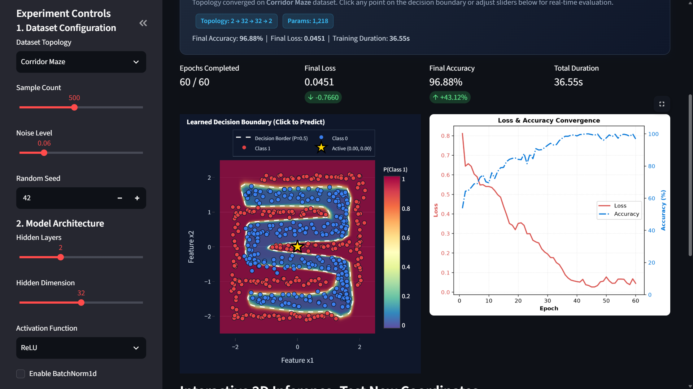
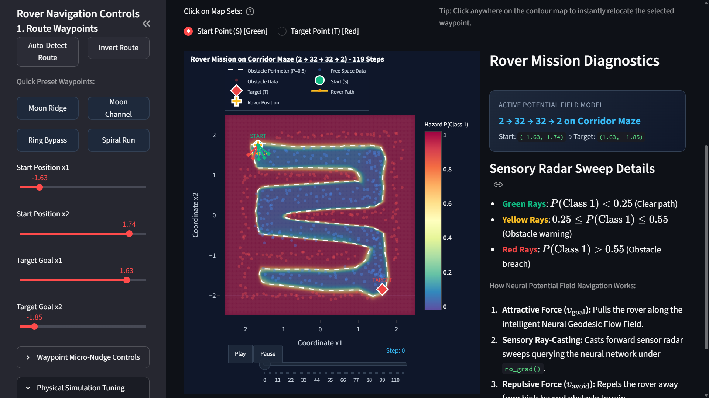
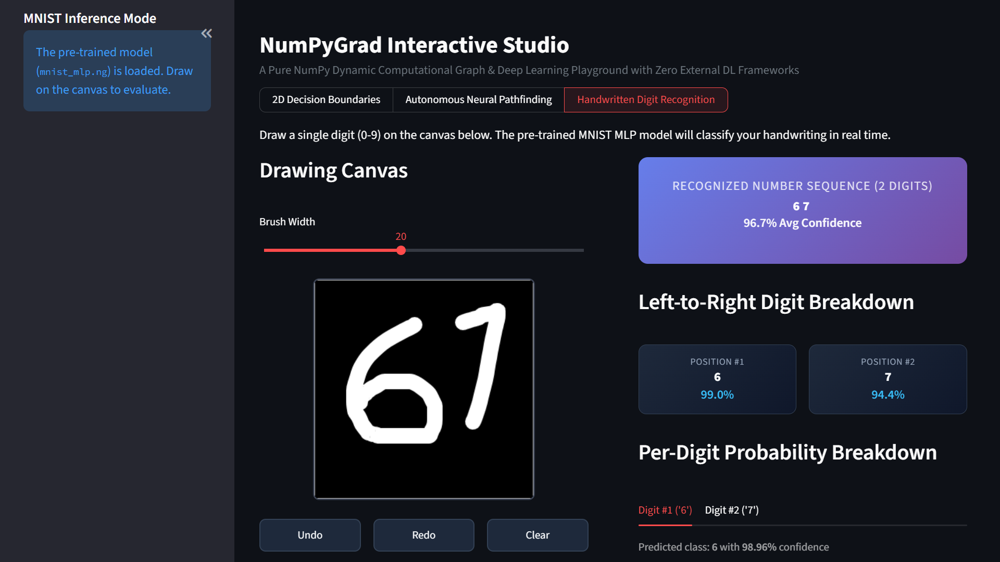

# NumPyGrad: Pure NumPy Autograd & Deep Learning Framework

[](https://www.python.org/downloads/)
[](#)
[](#)
[](LICENSE)
[](https://github.com/Htet-Aung/numpygrad)

**NumPyGrad** is an educational deep learning and reverse-mode automatic differentiation framework written completely from scratch in **pure Python and NumPy**, with **zero external deep learning framework dependencies** (no PyTorch, JAX, TensorFlow, or compiled C++ extensions).

Designed for mathematical clarity and architectural transparency, NumPyGrad demystifies how modern autograd engines and deep neural networks operate under the hood—from dynamic computation graph construction, topological sorting, and broadcasting-aware gradient reduction to vectorized 2D convolutions, spatial pooling, and adaptive optimizers.

The framework features two flagship interactive showcase applications within the built-in Streamlit Studio:
1. **2D Decision Boundary Explorer:** Real-time neural network training on non-linear synthetic manifolds (Two Moons, Circles, Spirals), interactive gold-star click-to-predict inference, side-by-side model capacity comparisons, and step-by-step computation trace inspection.
2. **Live Handwritten Digit Recognition Canvas:** Real-time MNIST drawing canvas with brush width controls, connected-component segmentation for multi-digit sequences, and live Plotly class probability distributions.

---

## Visual Showcase: Non-Linear Decision Boundary

NumPyGrad trains multi-layer perceptrons to resolve complex non-linear classification manifolds through topological reverse-mode backpropagation and AdamW optimization:

<p align="center">
  
</p>

---

## Comprehensive Feature Breakdown

### 1. Autograd Core & Calculus Engine
- **Dynamic Reverse-Mode DAG:** Constructs computation graphs on the fly where each differentiable operation dynamically tracks predecessor nodes (`_prev`) and local Jacobian-vector product closures (`_backward`).
- **Topological Backpropagation:** Evaluates gradients via depth-first topological traversal, guaranteeing that parent dependencies are resolved before propagating upstream gradients and correctly accumulating multi-branch gradients (`grad += ...`).
- **Broadcasting Reduction Calculus (`_unbroadcast`):** Handles NumPy broadcasting across operands of differing shapes (e.g. `(N, D) + (D,)`), projecting accumulated gradients back to original input shapes by summing out broadcasted leading and singleton axes.
- **Extensive Differentiable Tensor Operations:**
  - *Arithmetic & Algebra:* `+`, `-`, `*`, `/`, `@` (matrix multiplication), `**` (power), `-` (unary negation), and tensor slicing (`__getitem__`).
  - *Shape Transformations:* `reshape`, `transpose`, `T`, `squeeze`, `unsqueeze`, and `concat` (`cat`).
  - *Reductions:* `sum`, `mean` along specified axes or across all dimensions.
- **Autograd Execution Guards:** `no_grad()`, `enable_grad()`, `is_grad_enabled()`, and `set_grad_enabled()` for disabling graph retention during inference.

### 2. Layers, Vision & Activations
- **PyTorch-Style Modular Hierarchy:** Base `Module` and `Parameter` abstractions with recursive parameter registration, `state_dict()`, `load_state_dict()`, and mode switching (`train()` / `eval()`).
- **Vectorized Spatial Convolutions (`Conv2D`):** Implements 2D spatial convolutions using `im2col` matrix unfolding and analytical `col2im` gradient scattering in pure NumPy, avoiding slow nested loops.
- **Spatial Max Pooling (`MaxPool2D`):** Spatial downsampling with spatial argmax gradient routing during backpropagation.
- **Normalization & Regularization:**
  - `BatchNorm1d`: Exponential moving average running statistics during training and fixed running statistics during evaluation.
  - `Dropout`: Inverted dropout scaling (`1 / (1 - p)`) during training and identity pass during evaluation.
  - `Flatten`: Unrolls multi-dimensional spatial tensor activations to `(N, -1)`.
- **Containers & Activations:**
  - `Sequential`: Cascaded linear container for modular model assembly.
  - Non-linear activations: `ReLU`, `Sigmoid` (numerically stable), `Tanh`, and `GELU`.

### 3. Losses & First-Order Optimizers
- **Loss Criteria:**
  - `CrossEntropyLoss`: Numerically stable categorical cross-entropy combining LogSoftmax and NLLLoss via the Log-Sum-Exp trick to eliminate floating-point overflow and underflow.
  - `MSELoss`: Mean squared error criterion for regression.
  - `BCEWithLogitsLoss`: Binary cross-entropy with integrated sigmoid activation.
- **Optimizers:**
  - `SGD`: Stochastic gradient descent with Polyak momentum velocity buffers and L2 weight decay.
  - `AdamW`: Adaptive moment estimation with first and second moment bias correction and decoupled weight decay.

### 4. Single-File Persistence (`.ng` Format)
- Robust, uncorruptible container serialization storing both network architecture and parameter weights in a single `.ng` archive:
  - `architecture.json`: Complete layer hierarchy, types, hyperparameters, and topology layout.
  - `weights.npz`: Compressed parameter tensors and non-trainable buffers.
- Unified API: `model.save("model.ng")`, `save_model(model, filepath)`, and `load_model(filepath)`.

### 5. Diagnostics & Numerical Verification
- **Model Inspection (`model.summary`):** Formatted ASCII reports detailing layer-by-layer output shapes, trainable parameter counts, non-trainable buffers, and estimated memory footprints.
- **Centered Finite-Difference Verification (`gradcheck`):** Validates analytical gradients against two-sided numerical approximations:
  $$\frac{\partial f}{\partial x_i} \approx \frac{f(x + \epsilon e_i) - f(x - \epsilon e_i)}{2\epsilon}$$
  Strictly verified to maintain relative error tolerances $< 10^{-5}$.

---

## Installation

Install NumPyGrad in editable development mode with pip:

```bash
git clone https://github.com/Htet-Aung/numpygrad.git
cd numpygrad
pip install -e .
```

To include optional dependencies for the interactive Streamlit Studio:

```bash
pip install -e ".[app]"
```

---

## Quickstart & Usage Examples

Build, inspect, train, evaluate, and persist a convolutional neural network in under 40 lines of pure Python:

```python
import numpy as np
import numpygrad as ng
import numpygrad.nn as nn
import numpygrad.optim as optim
from numpygrad import Tensor, no_grad, load_model
from numpygrad.data import TensorDataset, DataLoader

# 1. Build a Convolutional Neural Network with Sequential
model = nn.Sequential(
    nn.Conv2D(in_channels=1, out_channels=8, kernel_size=3, padding=1),
    nn.ReLU(),
    nn.MaxPool2D(kernel_size=2, stride=2),
    nn.Flatten(),
    nn.Linear(in_features=8 * 14 * 14, out_features=10)
)

# 2. Inspect Model Topology & Parameters
model.summary(input_shape=(1, 28, 28))

# 3. Setup Loss Criterion, Optimizer, and DataLoader
criterion = nn.CrossEntropyLoss()
optimizer = optim.AdamW(model.parameters(), lr=1e-3, weight_decay=1e-4)

X_data = np.random.randn(128, 1, 28, 28).astype(np.float32)
y_data = np.random.randint(0, 10, size=(128,))

dataset = TensorDataset(X_data, y_data)
loader = DataLoader(dataset, batch_size=32, shuffle=True)

# 4. Standard Training Loop
model.train()
for epoch in range(3):
    for batch_x, batch_y in loader:
        optimizer.zero_grad()
        logits = model(batch_x)
        loss = criterion(logits, batch_y)
        loss.backward()
        optimizer.step()
    print(f"Epoch {epoch + 1} | Loss: {loss.data:.4f}")

# 5. Evaluation & Inference under no_grad()
model.eval()
with no_grad():
    sample = Tensor(X_data[:5])
    predictions = np.argmax(model(sample).data, axis=-1)
    print(f"Inference Predictions: {predictions}")

# 6. Save and Reload .ng Container Artifact
model.save("conv_model.ng")
reloaded_model = load_model("conv_model.ng")
```

---

## Interactive Studio (Streamlit Dashboard)

Launch the interactive web studio for real-time visualization and tactile experimentation:

```bash
# Launch via one-click runner (Windows Batch / PowerShell)
.\dev.bat
# or
.\dev.ps1

# Or run standard Streamlit CLI
streamlit run app/app.py
```

### 1. 2D Decision Boundary Studio & Live Convergence
Live training on non-linear synthetic manifolds (Two Moons, Circles, Spirals, Corridor Maze) with full-span decision contours, smooth probability surface rendering, real-time loss and accuracy convergence curves, and direct **Click-to-Predict** coordinate inference with active gold star markers.

<p align="center">
  
</p>

### 2. Autonomous Neural Pathfinding & Obstacle Avoidance
Interactive robotics simulator where learned neural classification boundaries act as **dynamic artificial potential fields**. The rover emits multi-angle sensory rays to detect boundary hazards in real time, steering smoothly around obstacles with tangential wall-following to reach destination targets.

<p align="center">
  
</p>

### 3. Live Handwritten Digit Recognition Canvas
Interactive drawing canvas with customizable brush width and native stroke history controls (Undo, Redo, Clear). Features pure NumPy connected-component segmentation to recognize multi-digit sequences (e.g. sequence `"67"` with per-digit bounding boxes and position confidence breakdowns) as well as single digits, evaluating real-time inference against pre-trained MNIST models (`examples/mnist_mlp.ng`) with interactive Plotly probability distributions.

<p align="center">
  
</p>

---

## Reproducing Examples & Benchmarks

NumPyGrad includes standalone reproduction scripts for standard datasets and benchmarks:

```bash
# 1. Train Synthetic 2D Decision Boundaries (Two Moons, Circles, Spirals)
py -3.13 examples/train_synthetic_2d.py

# 2. Train Multi-Class Iris Tabular Classifier (>96% Accuracy)
py -3.13 examples/train_iris.py

# 3. Train Flagship MNIST Multi-Layer Perceptron (97.55% Test Accuracy)
py -3.13 examples/train_mnist_mlp.py

# 4. Train Flagship MNIST Convolutional Neural Network (98.35% Test Accuracy)
py -3.13 examples/train_mnist_cnn.py

# 5. Run CPU Micro-Benchmark vs. PyTorch C++ Engine
py -3.13 benchmarks/benchmark_cpu.py
```

### Benchmark Summary (MNIST Classification)

| Model Architecture | Parameters | Parameter Reduction | Test Accuracy | Step Latency (B=128) |
|---|---|---|---|---|
| **MLP Baseline** | 109,386 | Baseline | 97.55% | ~15.6 ms |
| **NumPyGrad CNN** | 52,138 | **-52.3%** | **98.35%** | ~173.2 ms |

### CPU Throughput: Pure NumPy vs. PyTorch C++ (3-Layer MLP, B=128)

| Engine | Backend | Step Latency (Fwd + Bwd) | Throughput |
|---|---|---|---|
| **NumPyGrad** | Pure Python + NumPy | **2.21 ms** | **~58,000 samples/sec** |
| **PyTorch** | Native C++ (LibTorch CPU) | **1.85 ms** | **~69,000 samples/sec** |

---

## Automated Testing & Gradient Verification

Run the complete test suite with 100% passing test coverage:

```bash
pytest -v
```

Or via Python 3.13:
```bash
py -3.13 -m pytest -v
```

To run standalone numerical finite-difference checks on all layers:

```bash
py -3.13 .agents/skills/gradcheck-verifier/scripts/verify_grad.py --layer all
```

---

## Project Philosophy & Non-Goals

NumPyGrad was built to explore the mathematical and architectural mechanics of deep learning systems. Every matrix operation, gradient accumulation hook, and graph traversal step remains plain, readable, and debuggable in Python.

### Non-Goals
- **No GPU / CUDA Acceleration:** Execution is strictly CPU-bound to prioritize clean, readable NumPy code over hardware-specific CUDA kernels.
- **No Distributed Scaling:** Built for single-machine conceptual understanding, learning, and rapid experimentation.
- **Not a Production Framework Replacement:** NumPyGrad is an educational artifact and portfolio project, not a competitor to industrial frameworks like PyTorch or JAX.

---

## License

This project is open-source software licensed under the [MIT License](LICENSE).
